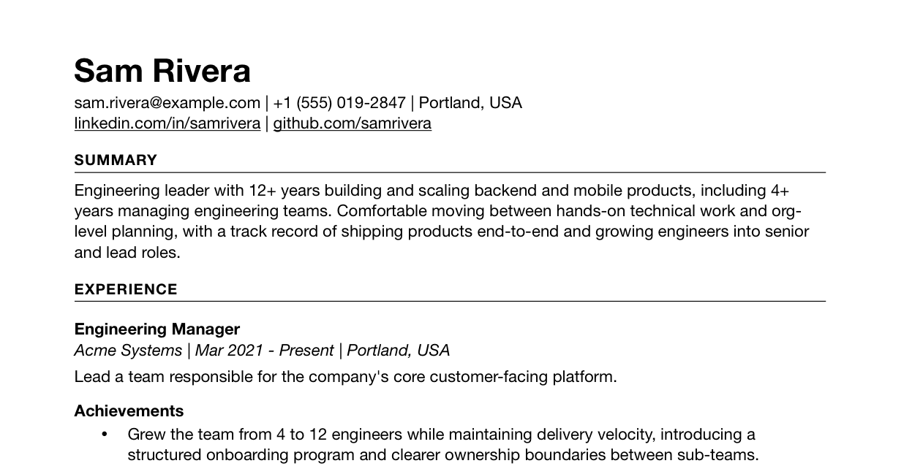

# KISS Résumé 💋 (Keep It Super Simple)

Author your own résumé in a simple Markdown format, run `resume` and get a well formatted, accessible PDF. 

Easily maintain your résumé and generate new versions automatically by making `resume` part of your workflow.

Pipeline: **Markdown → HTML → PDF** (via [WeasyPrint](https://weasyprint.org)).

<a href="docs/resume.pdf"></a>

See an [example](docs/resume.md) résumé and the [generated output](docs/resume.pdf). 

## Install & run

Requires [uv](https://docs.astral.sh/uv/). WeasyPrint also needs system libs
(pango, cairo, gdk-pixbuf); on macOS: `brew install pango gdk-pixbuf`.

### Files

| File          | Role                                                            |
|---------------|-----------------------------------------------------------------|
| `resume.md`   | **Content.** Frontmatter (name/contact) + Markdown body.        |
| `style.css`   | **Presentation.** All visual styling; values come from `config.yaml`. |
| `config.yaml` | **Knobs.** Page size, margins, fonts, sizes, spacing, bullets.  |
| `resume/`     | The pipeline (a `uv`-installed package). Reads the three files, writes the PDF. Bundles a default `style.css`/`config.yaml` (`resume/data/`) used when a directory has only a `resume.md`. |

```bash
uv sync                # create venv, install deps (incl. dev tools)
uv run resume                       # -> resume.pdf, from the current dir
uv run resume --out "Resume.pdf"
uv run resume --md resume.md --css style.css --config config.yaml --out out.pdf
```

Install globally as a `resume` command on PATH:

```bash
uv tool install .                    # then `resume` works anywhere
resume --md ~/resumes/resume.md --out ~/Desktop/Resume.pdf
```

All inputs and the output PDF default to the **current working directory**.
`style.css`/`config.yaml` fall back to the tool's bundled defaults when a
directory has none of its own — drop your own copies next to `resume.md` (or
pass `--css`/`--config`) to override.

Every page gets the build date (e.g. "July 1, 2026") in small light-gray type
in the bottom-right page margin, in the document's font. Pass `--no-date` to
omit it.

### macOS: telling WeasyPrint where the libs are

WeasyPrint loads Pango/GObject via `cffi.dlopen`, which on macOS can't find
Homebrew's versioned dylibs (`libgobject-2.0.0.dylib`) by their Linux-style
soname. Set `DYLD_LIBRARY_PATH` at process start so the loader can find them:

```bash
DYLD_LIBRARY_PATH=/opt/homebrew/lib uv run resume
# or, after `uv tool install .`:
DYLD_LIBRARY_PATH=/opt/homebrew/lib resume --out Resume.pdf
```

(`export`ing it once in your shell rc avoids repeating it.)

## Markdown conventions

Heading levels map to the résumé structure:

| Markdown | Element                | Example                          |
|----------|------------------------|----------------------------------|
| `#`      | H1 — section header (UPPERCASE) | `# Summary`, `# Experience` |
| `##`     | H2 — role / entry      | `## Engineering Manager`         |
| `###`    | H3 — sub-heading       | `### Achievements`               |
| `*…*`    | meta line (italic): company \| dates \| location | `*Acme Systems \| Mar 2021 - Present \| Portland, USA*` |
| `- `     | bullet                 | `- Grew the team from 4 to 12 engineers …` |
| body text| paragraph (summary, role blurb) | `Engineering leader with 12+ years …` |
| `[text](url)` | link (works in the body *and* in a `contact:` line) | `[github.com/samrivera](https://github.com/samrivera)` |

A line that is *only* italic (`*…*`) is detected as a **meta line** and styled accordingly. Italic used mid-sentence stays normal emphasis.

### Links

Standard Markdown link syntax, `[text](url)`, works both in the body and in
a `contact:` line.

Link color and underline are configurable via `--link-color` /
`--link-decoration` in `config.yaml` (`style:` block) — they default to the
surrounding text color and `underline`, not the browser-default blue.

### Page breaks

Insert an HTML comment on its own line where a new page should start:

```markdown
<!-- break -->
```

`<!-- pagebreak -->` and `<!-- newpage -->` work too. Each one forces the following content onto a new page (`break-before: page`). The current résumé uses one, before the earliest role, to demonstrate splitting experience across pages.

## Customizing the look

Copy `resume/data/config.yaml` next to your `resume.md` and edit that as necessary. Local files will override  the bundled default. Everything under `style:` is injected as a CSS custom property, so you can retune without touching `style.css`. Common changes:

```yaml
page:
  size: "595pt 842pt"      # A4 instead of US Letter
  margin: "40pt 50pt 40pt 50pt"

style:
  "--font-family": '"Helvetica Neue", Helvetica, Arial, sans-serif'
  "--base-size": "10.5pt"
  "--line-height": "13.5pt"
  "--h1-transform": "none"     # stop upper-casing section headers
  "--bullet-char": '"\2022"'   # smaller round bullet (• )
```

For structural style changes (new selectors, borders, two-column, etc.) edit `style.css` directly. The `@page` rule (size + margins) is generated by `resume.builder` from `config.yaml`, because WeasyPrint does not resolve `var()` inside `@page`.

## PDF/UA-1
The output is a tagged **PDF/UA-1** — the ISO standard (14289-1) for accessible PDF. Rather than just painting text at fixed positions on the page, the PDF carries a structure tree marking what's a heading, a paragraph, or a list item, along with reading order and language metadata. That's the same structure screen readers rely on to navigate the document by section. Text copied from these PDFs will reflows by paragraph instead of breaking at every visual line.

## Notes on fonts & fidelity

This pipeline defaults to a Helvetica-compatible stack (`Nimbus Sans` / `Liberation Sans` on Linux). For a pixel match to Helvetica Neue, run on a machine that has it installed and set `--font-family` accordingly. WeasyPrint will embed whatever it resolves at build time, so the PDF renders identically everywhere afterward.
